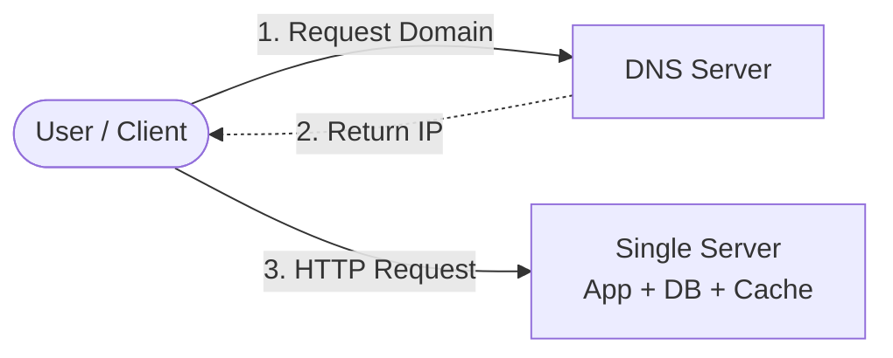
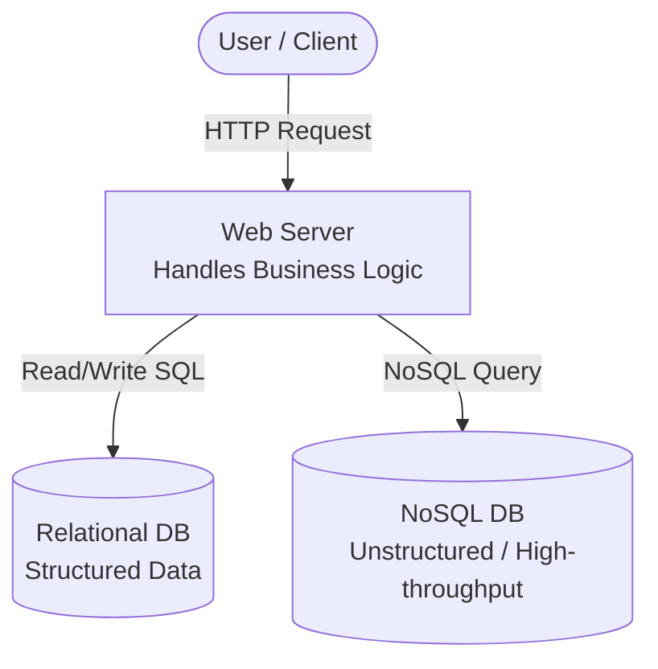
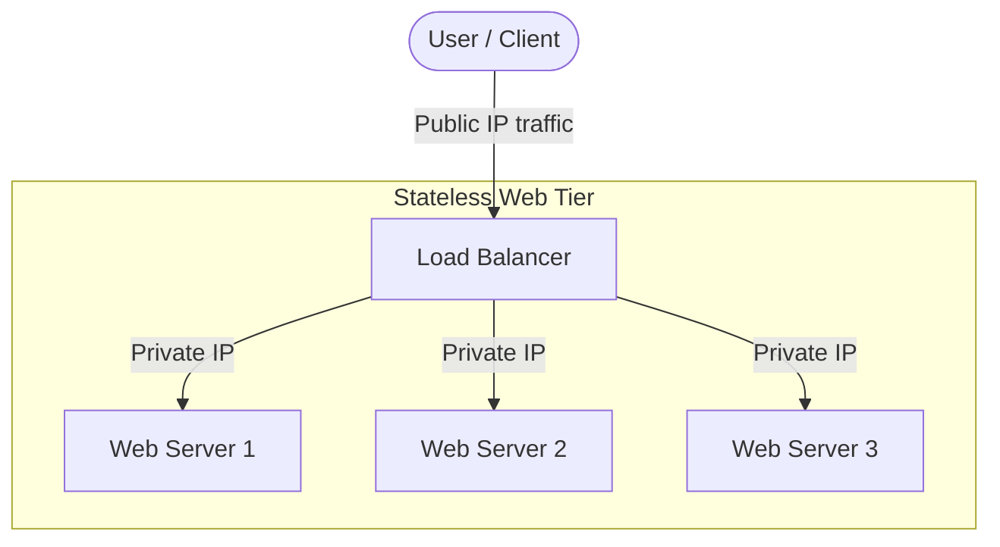
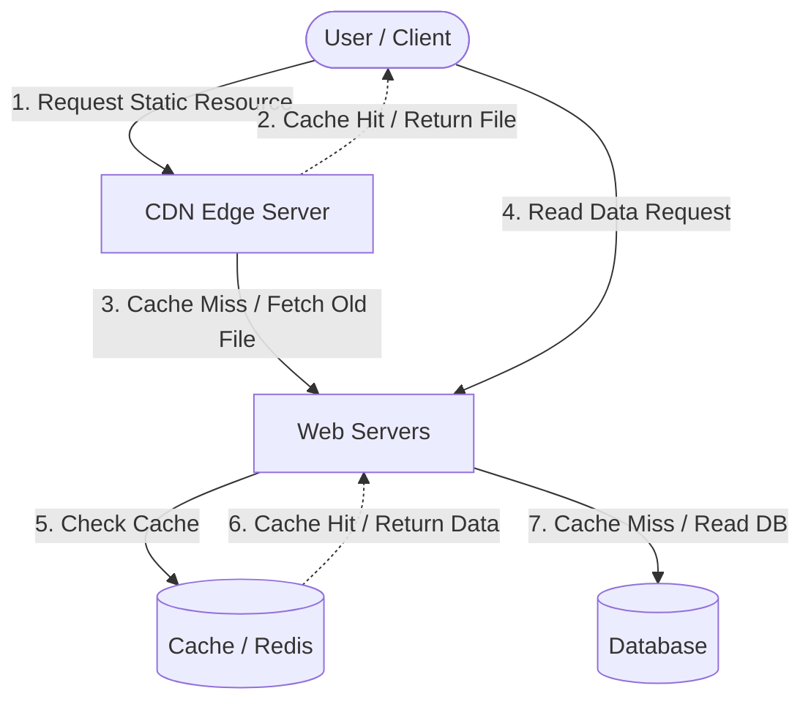
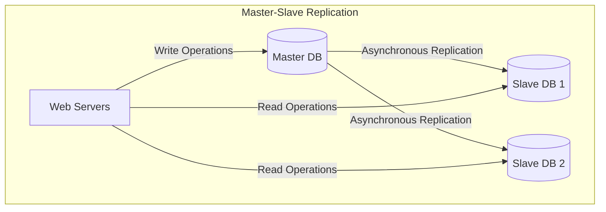
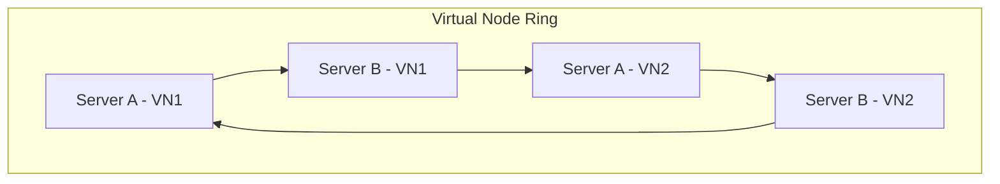
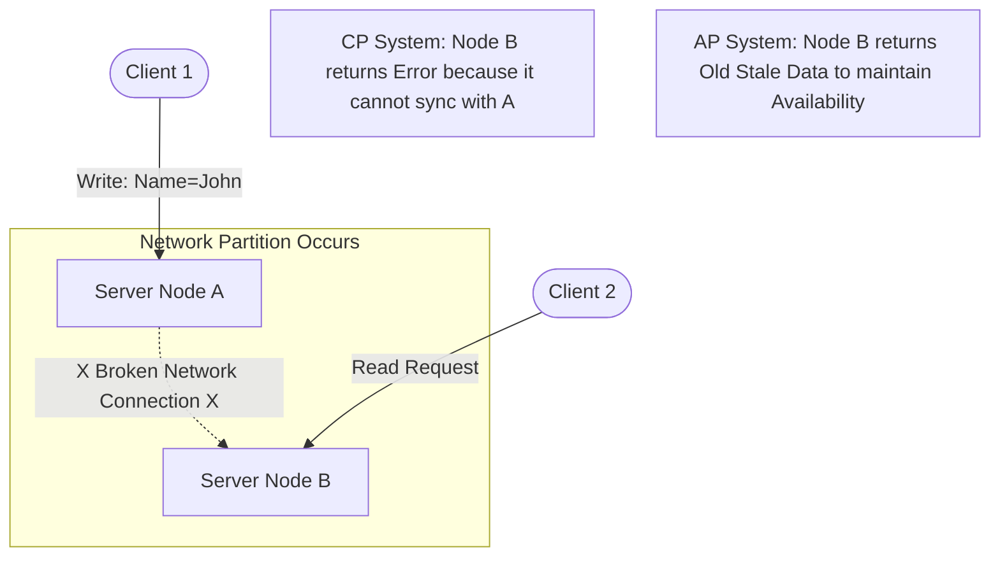
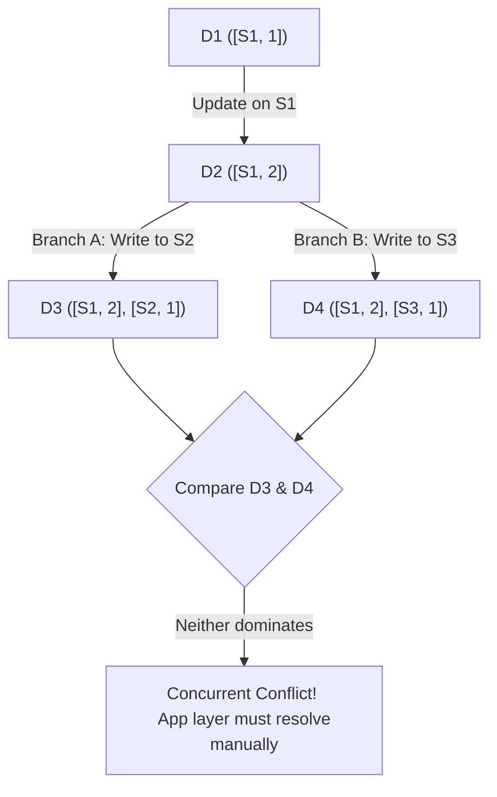

### Nội dung tập tin `system-design-complete.md`

# Tài Liệu Tổng Hợp Kiến Thức Thiết Kế Hệ Thống (System Design)
*Dựa trên tài liệu System Design Interview của Alex Xu*

---

## CHƯƠNG 1: SCALE FROM ZERO TO MILLIONS OF USERS
*Lộ trình tiến hóa kiến trúc hệ thống phục vụ từ một người dùng ban đầu cho đến khi đạt quy mô hàng triệu người dùng.*[cite: 3]

### 1. Thiết lập một Máy chủ duy nhất (Single Server Setup)
* **Mô hình:** Ban đầu, tất cả mọi thành phần bao gồm Web App, Database, Cache... đều được cấu hình chạy chung trên một máy chủ vật lý duy nhất[cite: 3].
* **Luồng xử lý:** Người dùng nhập domain $\rightarrow$ DNS trả về IP Public $\rightarrow$ Client gửi HTTP request trực tiếp đến Server.
* **Hạn chế:** Lỗi tại một điểm (**SPOF - Single Point of Failure**). Nếu server sập, toàn bộ ứng dụng sẽ ngừng hoạt động[cite: 3].



### 2. Tách biệt Cơ sở dữ liệu (Tách Database)

Khi lượng truy cập gia tăng, việc gánh vác cả logic ứng dụng lẫn các câu lệnh truy vấn dữ liệu nặng nề làm cạn kiệt tài nguyên máy chủ. Hệ thống cần tách Web Server và Database Server thành hai thực thể độc lập.

* **SQL (Relational DB):** Phù hợp dữ liệu có cấu trúc chặt chẽ (như MySQL, PostgreSQL, Oracle). Hỗ trợ các mối quan hệ phức tạp (JOIN) và yêu cầu tính toàn vẹn cao (ACID).


* **NoSQL (Non-Relational DB):** Phù hợp dữ liệu phi cấu trúc, cần độ trễ cực thấp, tần suất ghi cao và chỉ cần truy vấn dạng key-value, document hoặc graph (như MongoDB, Cassandra, DynamoDB).




### 3. Mở rộng Hệ thống (Vertical vs. Horizontal Scaling) & Load Balancer

* **Mở rộng theo chiều dọc (Vertical Scaling / Scale Up):** Tăng cường sức mạnh phần cứng (CPU, RAM, SSD) cho máy chủ hiện tại.


* *Hạn chế:* Có giới hạn vật lý nghiêm ngặt (không thể thêm RAM vô hạn) và không mang tính dự phòng chịu lỗi.


* **Mở rộng theo chiều ngang (Horizontal Scaling / Scale Out):** Bổ sung thêm nhiều máy chủ chạy song song vào hệ thống. Đây là con đường bắt buộc để xây dựng hệ thống quy mô lớn.


* **Load Balancer:** Nhận request từ Public IP của người dùng và phân phối đều cho cụm Web Server phía sau qua IP nội bộ (Private IP), giúp tăng cường tính chịu lỗi (**Failover**).




### 4. Tối ưu hóa hiệu năng: Cache và CDN

Để giảm tải áp lực trực tiếp lên hệ thống Database, hai lớp đệm được tích hợp:

* **Cache (Bộ nhớ đệm tầng ứng dụng):** Lưu trữ dữ liệu có tần suất đọc cao nhưng ít thay đổi (như Redis, Memcached) trực tiếp trên bộ nhớ RAM, giúp giảm thời gian phản hồi từ mili-giây xuống micro-giây.


* **CDN (Mạng phân phối nội dung):** Sử dụng một mạng lưới các máy chủ proxy đặt rải rác trên toàn thế giới để lưu trữ các tài nguyên tĩnh (Hình ảnh, Video, CSS, JavaScript) gần vị trí địa lý của người dùng nhất.




### 5. Thiết kế Web không lưu trạng thái (Stateless Web Tier)

Để cụm Web Server có thể co giãn một cách tự do, trạng thái phiên làm việc của người dùng (Session/Token) không được phép lưu trữ cục bộ trong RAM của từng Web Server nữa.

* Toàn bộ dữ liệu trạng thái được chuyển ra lưu trữ tập trung tại một hạ tầng dùng chung bên ngoài (như Redis hoặc NoSQL Cluster).


* Khi đó, các Web server trở thành "**Stateless**", có thể tắt đi hoặc bật thêm mà không ảnh hưởng tới trải nghiệm người dùng.


### 6. Chiến lược Mở rộng Database (Database Scaling)

Khi tầng Web đã được tối ưu, Database sẽ trở thành nút thắt cổ chai tiếp theo. Hai kỹ thuật cốt lõi bao gồm:

* **Replication (Nhân bản Master/Slave):** Máy chủ Master chịu trách nhiệm thực hiện các tác vụ Ghi (Write/Update/Delete). Toàn bộ dữ liệu được đồng bộ bất đồng bộ xuống các máy chủ Slave chỉ phục vụ tác vụ Đọc (Read). Kỹ thuật này đáp ứng bài toán thực tế khi lượng đọc thường áp đảo lượng ghi (tỷ lệ 80/20).


* **Sharding (Phân mảnh dữ liệu theo chiều ngang):** Chia tách một cơ sở dữ liệu khổng lồ thành các mảnh nhỏ hơn (shards) dựa trên một trường dữ liệu định danh (**Sharding Key**). Mỗi shard được lưu giữ trên một thực thể server vật lý độc lập giúp tăng dung lượng lưu trữ tổng thể vô hạn.




### 7. Hạ tầng bổ trợ cho hệ thống triệu người dùng

* **Đa trung tâm dữ liệu (Multi-Data Center):** Triển khai hệ thống ở nhiều vùng địa lý khác nhau để định tuyến người dùng theo vị trí gần nhất (Geo-routing) và dự phòng thảm họa diện rộng.


* **Hàng đợi tin nhắn (Message Queue):** Sử dụng cấu trúc bất đồng bộ (như Kafka, RabbitMQ) để giải nén áp lực xử lý của hệ thống khi có lưu lượng tăng đột biến, giúp các service giao tiếp lỏng lẻo (loose coupling) hơn.


---

## CHƯƠNG 2: CONSISTENT HASHING (BĂM NHẤT QUÁN)

*Giải pháp thiết kế phân phối dữ liệu hiệu quả nhằm giải quyết triệt để bài toán mở rộng hệ thống (scaling) của kỹ thuật băm truyền thống.*

### 1. Vấn đề của cách băm truyền thống

Công thức truyền thống sử dụng để điều hướng dữ liệu đến các máy chủ (server):


$$\text{Server Index} = \text{hash}(\text{key}) \pmod n$$


Trong đó **n** là số lượng server hiện tại trong hệ thống. Kỹ thuật này gặp phải một điểm yếu cốt tử:

* Khi một server bị sập ($n$ giảm) hoặc khi một server mới được thêm vào ($n$ tăng), kết quả của phép toán chia lấy dư ($\%$) sẽ thay đổi đối với phần lớn các key hiện tại.


* **Hậu quả:** Dữ liệu trên hệ thống bị điều hướng sai lệch hàng loạt, gây ra hiện tượng sập bộ nhớ đệm (**Cache Miss**) trên diện rộng, ép hệ thống phải truy vấn trực tiếp vào Database và có thể dẫn đến sập toàn bộ hệ thống.


### 2. Nguyên lý hoạt động của Vòng tròn băm (Hash Ring)

Consistent Hashing giải quyết vấn đề bằng cách băm cả Server lẫn Key dữ liệu lên cùng một không gian số khép kín (ví dụ từ $0$ đến $2^{32}-1$) được gọi là Vòng tròn băm (Hash Ring).

| Các Bước Thực Hiện | Cơ Chế Hoạt Động |
| --- | --- |
| **Bước 1: Định vị Server** | Băm địa chỉ IP hoặc tên của Server ($S_0, S_1, S_2$) thành một số nguyên và xếp vào các vị trí tương ứng trên vòng tròn số.

|
| **Bước 2: Định vị Key** | Băm khóa dữ liệu (ví dụ: `user_id`) bằng cùng một hàm băm để xác định vị trí của nó trên cùng một vòng tròn.

|
| **Bước 3: Định tuyến Dữ liệu** | Từ vị trí của Key, quét xuôi theo **chiều kim đồng hồ** trên vòng tròn băm. Máy chủ vật lý đầu tiên gặp phải sẽ chịu trách nhiệm lưu trữ và xử lý Key đó.

|

**Cơ chế khi Thêm/Bớt Server:** Khi một server mới được thêm vào hoặc một server cũ bị loại bỏ, chỉ có một phần nhỏ dữ liệu nằm trong phân đoạn bị ảnh hưởng cần phải phân phối lại (xấp xỉ $1/n$ lượng dữ liệu), toàn bộ dữ liệu ở các phân đoạn khác hoàn toàn giữ nguyên.

```mermaid
graph TD
    subgraph Hash Ring (0 to 2^32-1)
        NodeA[Server A] -->|Clockwise Flow| Key1((Key 1))
        Key1 -->|Stored in| NodeB[Server B]
        NodeB -->|Clockwise Flow| Key2((Key 2))
        Key2 -->|Stored in| NodeC[Server C]
        NodeC -->|Clockwise Flow| NodeA
    end

```

### 3. Kỹ thuật Nút ảo (Virtual Nodes) để tối ưu hóa

Nếu chỉ đặt các server vật lý trực tiếp lên vòng tròn, các server có thể phân phối không đều, dẫn đến tình trạng một server phải chịu tải quá lớn (**Hotspot**) trong khi server khác lại quá thong thả.

* **Giải pháp:** Tạo ra nhiều nút ảo (Virtual Nodes) hay các "phân thân" của một server vật lý nằm rải rác trên vòng tròn băm (ví dụ: $S0\_1, S0\_2, S0\_3\dots$).


* **Kết quả:** Khi số lượng nút ảo đủ lớn, không gian phân hoạch trên vòng tròn băm được chia cực kỳ đồng đều, giúp lưu lượng tải phân phối cân bằng trên toàn bộ cụm máy chủ vật lý, tránh lỗi điểm nóng (Hotspot).




---

## CHƯƠNG 3: ĐỊNH LÝ CAP & HỆ THỐNG PHÂN TÁN

*Định lý CAP khẳng định rằng một hệ thống phân tán chỉ có thể đảm bảo tối đa 2 trong số 3 yếu tố tại cùng một thời điểm.*

### 1. Ba cột trụ của CAP

* **C - Consistency (Tính nhất quán):** Tất cả các node đều thấy cùng một dữ liệu tại cùng một thời điểm. Mọi tác vụ đọc đều nhận được dữ liệu mới nhất hoặc trả về lỗi.


* **A - Availability (Tính sẵn sàng):** Mọi node hoạt động bình thường đều phải trả về phản hồi không lỗi, dù dữ liệu có thể không phải là mới nhất (không bị timeout hoặc chết đứng).


* **P - Partition Tolerance (Tính chịu lỗi đường truyền):** Hệ thống tiếp tục hoạt động bất chấp việc kết nối mạng giữa các node bị gián đoạn, chậm trễ hoặc mất gói tin.


Do mạng internet thực tế luôn có rủi ro bị đứt gãy hoặc mất kết nối mạng (**Network Partition - P**), hệ thống bắt buộc phải lựa chọn đánh đổi:

* **Hệ thống CP (Consistency + Partition Tolerance):** Chấp nhận hy sinh tính sẵn sàng. Khi mạng bị lỗi, hệ thống từ chối lệnh ghi hoặc khóa chức năng đọc/ghi để bảo vệ tính chính xác của dữ liệu.


* **Hệ thống AP (Availability + Partition Tolerance):** Chấp nhận hy sinh tính nhất quán tuyệt đối. Hệ thống vẫn cho phép đọc/ghi bình thường trên các node khả dụng, khiến các node tạm thời bị lệch dữ liệu và sẽ đồng bộ lại sau (**Eventual Consistency**).




### 2. Quorum Consensus (Đồng thuận số đông)

Quorum Consensus là cơ chế điều phối giúp cấu hình linh hoạt cán cân giữa tính Nhất quán (Consistency) và Sẵn sàng (Availability) thông qua bộ ba thông số:

* **N:** Tổng số bản sao dữ liệu (Số lượng replicas/servers lưu cùng một cục dữ liệu).


* **W:** Kích thước Quorum Ghi. Thao tác Ghi được coi là thành công nếu nhận được phản hồi xác nhận từ ít nhất $W$ replicas.


* **R:** Kích thước Quorum Đọc. Thao tác Đọc được coi là thành công nếu nhận được phản hồi từ ít nhất $R$ replicas.


**Quy tắc Strong Consistency (Nhất quán mạnh):** Hệ thống đạt trạng thái CP (luôn đọc được dữ liệu mới nhất) khi và chỉ khi cấu hình:


$$W + R > N$$


*Giải thích:* Khi tổng số nút ghi ($W$) và nút đọc ($R$) lớn hơn tổng số nút hệ thống ($N$), tập hợp các server tham gia vào quá trình Ghi và Đọc chắc chắn sẽ giao nhau tại ít nhất một node chung. Node chung này sẽ giữ phiên bản dữ liệu mới nhất, hệ thống sẽ so sánh timestamp để trả về kết quả chuẩn xác.

```mermaid
graph TD
    subgraph Distributed Cluster (N=3, W=2, R=2)
        Node1[Server 1]
        Node2[Server 2]
        Node3[Server 3]
    end
    
    ClientW([Client Write]) -->|Write to W=2 nodes| Node1
    ClientW -->|Write to W=2 nodes| Node2
    
    ClientR([Client Read]) -->|Read from R=2 nodes| Node2
    ClientR -->|Read from R=2 nodes| Node3
    
    style Node2 fill:#f9f,stroke:#333,stroke-width:2px;

```

### 3. Inconsistency Solution (Giải pháp xử lý dữ liệu bất nhất quán)

Trong các hệ thống ưu tiên tính sẵn sàng cao (AP), dữ liệu giữa các node có thể bị sai lệch tạm thời khi có cập nhật đồng thời (Concurrent Writes). Để phát hiện và giải quyết xung đột, hai giải pháp chính được áp dụng:

* **Versioning & Last-Write-Wins (LWW):** Gắn nhãn thời gian vật lý (timestamp) cho mỗi bản ghi. Khi có xung đột, giữ lại dữ liệu có timestamp mới nhất và loại bỏ bản cũ.


* *Hạn chế:* Đồng hồ vật lý giữa các server dễ bị lệch (**clock drift**), dẫn đến nguy cơ xóa nhầm dữ liệu mới của server có đồng hồ chạy chậm.


* **Vector Clock (Đồng hồ Vector):** Sử dụng danh sách các cặp `[server, version]` đi kèm với từng đơn vị dữ liệu để theo dõi lịch sử chỉnh sửa (lineage).


* *Quy tắc so sánh:* Version X là tổ tiên (Ancestor) của Version Y nếu mọi server counter trong $VC(X) \le VC(Y)$ và có ít nhất một counter nhỏ hơn ($<$). Khi đó Y có thể tự động ghi đè X.


* *Phát hiện xung đột:* Nếu không bên nào áp đảo bên nào (ví dụ $D_3([S1, 2], [S2, 1])$ và $D_4([S1, 2], [S3, 1])$), hệ thống xác định đây là **Concurrent Conflict (Xung đột đồng thời)**. Hệ thống sẽ lưu lại cả hai phiên bản dữ liệu và đẩy lên tầng ứng dụng (Client application) tự xử lý xung đột (**Conflict Resolution** - ví dụ như merge data).




---

## CHƯƠNG 4: KHUNG QUY TRÌNH PHỎNG VẤN SYSTEM DESIGN

*Quy trình 4 bước tiếp cận chuẩn mực áp dụng cho mọi bài thi thiết kế hệ thống.*

```mermaid
gantt
    title 4-Step System Design Interview Timeline (45 Minutes)
    dateFormat  X
    axisFormat %s
    
    Section Quy trình phỏng vấn
    Bước 1: Understand & Establish Scope  :active, p1, 0, 5
    Bước 2: High-level Design & Agreement :p2, after p1, 15
    Bước 3: Design Deep Dive              :p3, after p2, 20
    Bước 4: Wrap up & Review              :p4, after p3, 5

```

### BƯỚC 1: Hiểu rõ yêu cầu và xác định phạm vi hệ thống (3 - 5 phút)

Sai lầm lớn nhất của ứng viên là vừa nghe đề bài xong đã cắm đầu vào vẽ sơ đồ. Hãy chủ động đặt câu hỏi để thu hẹp phạm vi:

* **Functional Requirements (Tính năng cốt lõi):** "Hệ thống cần những tính năng chính nào? Người dùng có thể đăng bài, bình luận, hay chỉ xem bài thôi?"


* **Non-functional Requirements (Chỉ số phi tính năng):** "Hệ thống phục vụ bao nhiêu người dùng (DAU)? Hệ thống cần ưu tiên độ trễ thấp (low latency) hay tính nhất quán dữ liệu (strong consistency)?"


* **Back-of-the-envelope estimation (Tính toán sơ bộ):** Ước tính nhanh dung lượng lưu trữ (Storage), băng thông (Bandwidth), số lượng Request mỗi giây (QPS) để định hình quy mô phần cứng.


### BƯỚC 2: Thiết kế kiến trúc tổng thể và đạt sự đồng thuận (10 - 15 phút)

Mục tiêu bước này là vẽ ra một bản thiết kế thô (Blueprint) ở mức độ vĩ mô và nhận được cái gật đầu của người phỏng vấn trước khi đi sâu vào chi tiết.

* **Vẽ sơ đồ khối (Block diagram):** Vẽ các thành phần cơ bản nhất bao gồm: Clients $\rightarrow$ Load Balancer $\rightarrow$ Web Servers (API Gateways) $\rightarrow$ Lớp lưu trữ (Database, Cache).


* **Thiết kế luồng đi (API Endpoints):** Liệt kê một vài API chính để giải quyết tính năng ở Bước 1 (Ví dụ: `POST /v1/feed` để đăng bài, `GET /v1/feed` để lấy bài).


* **Xác định mô hình dữ liệu (Data Schema):** Đưa ra cấu trúc bảng dữ liệu cơ bản. Giai đoạn này chưa cần vẽ chi tiết thuộc tính từng bảng, nhưng phải định hình được sẽ dùng SQL hay NoSQL.


### BƯỚC 3: Đi sâu vào chi tiết các thành phần cốt lõi (10 - 25 phút)

Đây là lúc bạn thể hiện năng lực chuyên môn của mình. Người phỏng vấn sẽ chọn ra 1-2 cấu trúc quan trọng nhất trong sơ đồ tổng thể ở Bước 2 để yêu cầu bạn "mổ xẻ".

* **Tập trung vào nút thắt cổ chai (Bottlenecks):** Đưa ra giải pháp thiết kế chi tiết (Ví dụ: Thiết kế hệ thống chat thì dùng giao thức gì như Websocket; Thiết kế News Feed thì xử lý tài khoản người nổi tiếng - Celebrity problem như thế nào bằng cơ chế Fan-out).


* **Chiến lược tối ưu:** Đưa ra phương án sử dụng Cache ở đâu, Sharding DB theo key nào, đảm bảo tính sẵn sàng cao (High Availability) ra sao.


### BƯỚC 4: Tóm tắt và đánh giá lại hệ thống (3 - 5 phút)

Giai đoạn cuối cùng này giống như phần kết luận của một bài thuyết trình chuyên nghiệp.

* **Nhìn nhận khuyết điểm (Identify bottlenecks):** Không có hệ thống nào là hoàn hảo. Hãy chủ động chỉ ra: "Thiết kế hiện tại của tôi vẫn còn điểm yếu ở đoạn X, nếu có thêm thời gian, tôi sẽ cải tiến bằng cách áp dụng phương pháp Y...". Điều này chứng tỏ bạn là một kỹ sư có tư duy thực tế.


* **Tóm tắt luồng hoạt động:** Điểm lại một lượt từ lúc User gửi request cho đến khi nhận được kết quả để khắc sâu kiến trúc bạn vừa vẽ vào đầu người phỏng vấn.


```

```
